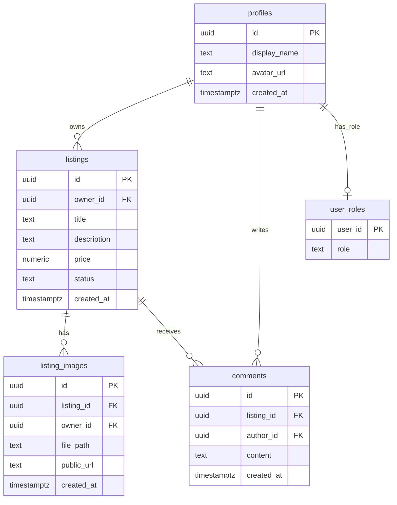

# Listings Marketplace

A full-stack multi-page listings marketplace where users can post, browse and manage listings with image uploads. Admins can moderate content.

## Live Demo

https://listings-marketplace-project-2026.netlify.app

## Tech Stack

| Layer | Technology |
| --- | --- |
| Frontend | Vanilla JavaScript, HTML5, CSS3 |
| UI Framework | Bootstrap 5 |
| Build Tool | Vite |
| Backend | Supabase |
| Database | PostgreSQL |
| Authentication | Supabase Auth |
| Storage | Supabase Storage |
| Hosting | Netlify |
| Source Control | GitHub |

## Features

- User registration and login
- Create, edit, delete listings with image upload
- Browse and search published listings
- Listing details with image gallery and download
- Comments on listings
- User profile with avatar upload
- Admin panel for user roles and listing moderation
- Row Level Security (RLS) on all tables

## Pages / Screens (8)

1. `index.html` – public listings feed and search
2. `login.html` – user login
3. `register.html` – user registration
4. `listing-create.html` – create listing with image upload
5. `listing-edit.html` – edit listing and manage images
6. `listing-details.html` – listing details, gallery, comments
7. `profile.html` – user profile and avatar upload
8. `admin.html` – admin moderation panel

## Database Schema

### 1) `profiles`

- `id` uuid PRIMARY KEY REFERENCES `auth.users(id)` ON DELETE CASCADE
- `display_name` text
- `avatar_url` text
- `created_at` timestamptz DEFAULT now()

### 2) `user_roles`

- `user_id` uuid PRIMARY KEY REFERENCES `auth.users(id)` ON DELETE CASCADE
- `role` text NOT NULL CHECK (`role` IN ('user', 'admin')) DEFAULT 'user'

### 3) `listings`

- `id` uuid PRIMARY KEY DEFAULT gen_random_uuid()
- `owner_id` uuid NOT NULL REFERENCES `auth.users(id)` ON DELETE CASCADE
- `title` text NOT NULL
- `description` text
- `price` numeric(10, 2)
- `status` text NOT NULL CHECK (`status` IN ('draft', 'published', 'archived')) DEFAULT 'draft'
- `created_at` timestamptz DEFAULT now()

### 4) `listing_images`

- `id` uuid PRIMARY KEY DEFAULT gen_random_uuid()
- `listing_id` uuid NOT NULL REFERENCES `listings(id)` ON DELETE CASCADE
- `owner_id` uuid NOT NULL REFERENCES `auth.users(id)`
- `file_path` text NOT NULL
- `public_url` text NOT NULL
- `created_at` timestamptz DEFAULT now()

### 5) `comments`

- `id` uuid PRIMARY KEY DEFAULT gen_random_uuid()
- `listing_id` uuid NOT NULL REFERENCES `listings(id)` ON DELETE CASCADE
- `author_id` uuid NOT NULL REFERENCES `auth.users(id)` ON DELETE CASCADE
- `content` text NOT NULL
- `created_at` timestamptz DEFAULT now()

## ER Diagram



## Local Setup

1. Clone the repository:

   ```bash
   git clone <your-repository-url>
   ```

2. Install dependencies:

   ```bash
   npm install
   ```

3. Copy environment file and fill your Supabase credentials:

   ```bash
   cp .env.example .env
   ```

   On Windows PowerShell:

   ```powershell
   Copy-Item .env.example .env
   ```

4. Start development server:

   ```bash
   npm run dev
   ```

## Demo Credentials

- User: `user@demo.com` / `demo123`
- Admin: `admin@demo.com` / `admin123`